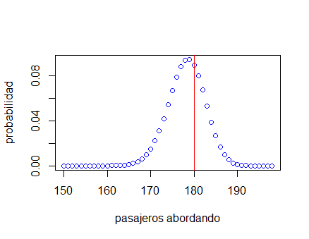

# Ejercicio uso de la distribución binomial
Este repositorio contiene un taller ilustrativo del uso de la distribución binomial.

## Ejemplos
Los siguientes archivos muestran ejemplos de uso de las distribuciones normal y binomial en R:
* [dist_normal.R](dist_normal.R): Ejemplo de uso de funciones de la distribución normal.
* [dist_binomial.R](dist_binomial.R): Ejemplo de uso de funciones de la distribución binomial.

## Taller
El taller está basado en el video TED-Ed [Why do airlines sell too many tickets?](https://www.youtube.com/watch?v=ZFNstNKgEDI), en el archivo [resolver.R](resolver.R) se encuentra código inicial para abordar el problema presentado en el video y en donde se genera el siguiente gráfico:

El taller consiste en demostrar que 198 es la sobreventa ideal de tickets con un gráfico que muestre:
* asientos vendidos (eje X, desde 170 hasta 210) vs revenue (eje Y),
* resaltar el pico de ganancia (revenue) en 198 con una linea vertical en 198 y una horizontal en máximo del gráfico.

## Entregable
Una o más commits que completen el taller ya sea modificando [resolver.R](resolver.R) o creando un archivo nuevo con la solución.
